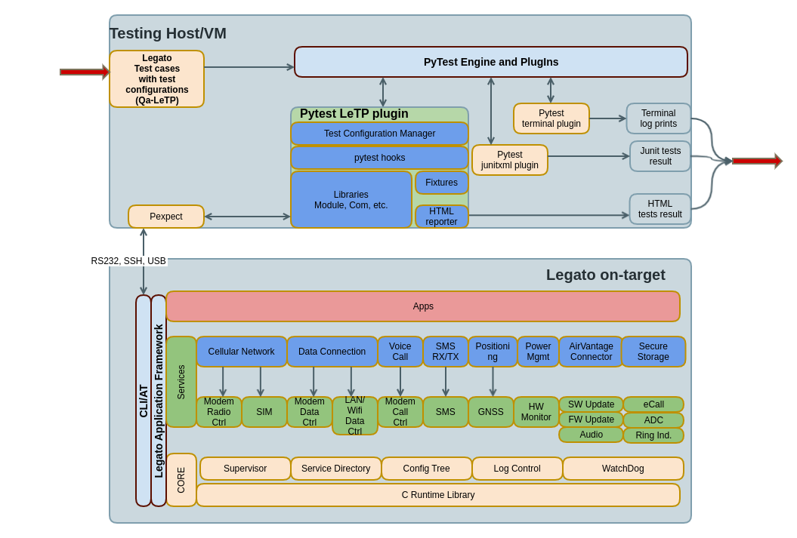

########
Concepts
########

.. toctree::
   :hidden:
   :maxdepth: 1
   :caption: Contents:

   scripting_concepts/libraries.rst
   scripting_concepts/pexpect.rst
   scripting_concepts/fixtures.rst
   scripting_concepts/test_configuration.rst
   scripting_concepts/test_campaign.rst

Please read: :ref:`introduction`

LeTP architecture
------------------

Here is the architecture about our concepts for developing your test scripts.

Pexpect based system testing
-----------------------------

Using com port to communicate with the testing target, read the output,
verify the output to see if it matches the expected.

:ref:`pexpect_libraries`

Test configuration management
------------------------------

The system tests may require some extra configuration, e.g. target type,
device port.

:ref:`test_configuration`

Test campaign
-------------

A Test campaign is a test suite with test configurations as the json file.

:ref:`test_campaign`

Pytest LeTP libraries
---------------------

pytest_letp provides libraries to facilitate common operations. e.g.
sim library, socker_server, etc.

:ref:`libraries`

Pytest LeTP fixtures
---------------------

:ref:`fixtures`

Test fixtures provide a fixed baseline so that tests execute reliably and
produce consistent, repeatable, results. Initialization may setup services,
state, or other operating environments. These are accessed by test functions
through arguments; for each fixture used by a test function there is typically
a parameter (named after the fixture) in the test function’s definition.

Users can also use
`pytest built-in fixtures <https://docs.pytest.org/en/stable/fixture.html>`_

LeTP can be used as a
`Pytest plugin <https://docs.pytest.org/en/stable/contents.html#toc>`_.

Copyright (C) Sierra Wireless Inc.